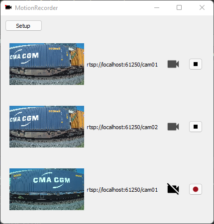

# Motion Recorder
This application records video when motion is detected in a period of time over a camera stream.
When the motion is detected, the application will start recording video related to a camera, and stop
several seconds after no motion is detected.

<table style="padding:10px">
	<tr>
	 	<td align="center"></td>
	</tr>
	<tr>
	 	<td align="center"">Capture of Motion Recorder with 3 cameras</td>
	</tr>
</table>


## Clarifications
This application has been done as an C++ evaluation test for AllRead. Some parts have been mocked, like Motion Detector module.
The number of cameras set in this project is hardcoded in the main file. There are three instances of MotionRecorderManager added to the main window.
The cameras set are also mocked, by using a docker container who streams the video through RTSP protocol. A file named 'train-example.mp4' must be placed in ./video folder.


## Requirements
* Docker and Docker-compose must be installed to be able to stream video using RTSP protocol.
* OpenCV must be installed. At this points, I am using OpenCV for capture the stream as well as for write the frames into a video file. Tested with version 3.4.16.
* Qt library also has the be installed, the GUI of this application has been developed using this framework. The application has been tested with version 5.15.2.


## Simple step by step guide
1.  Clone this repository
2.  cd to the root directory of the project
2.  Download the test file from http://allread-public-technical-evaluation.s3.amazonaws.com/train-example.mp4
3.  Copy the file from step 2 into the ./video folder
4.  Config the project by using the following command: 
	```bash
	$ cmake -S ./ -B ./bin/release -DCMAKE_PREFIX_PATH=[[QT_ROOT_DIR]]
	 ```
	 where QT_ROOT_DIR is the folder where binaries, libs and includes are located ( i.e. /home/nindef/Qt/5.15.2/gcc_64 )
5.  Build the project typing the command:
	```bash
	$ cmake --build ./bin/release/ --target all
	 ```
6.  Start the video stream executing the docker-compose command from the ./docker folder:
	```bash
	$ docker-compose -f ./docker-compose.yml up
	 ```
7.  Execute the binary built in ./bin/release/, named MotionRecorder

## About the GUI
* When the application is running with cameras configured, some symbols are displayed:
	<table style="padding:10px">
		<tr>
			<td align="center"></td>
			<td align="center"">The red point blinks when video is being recorded<br/>because of motion or because its recording<br/>some seconds after motion stops</td>
		</tr>
		<tr>
			<td align="center"></td>
			<td align="center"">When no motion is detected,<br/>the application will display this icon</td>
		</tr>
		<tr>
			<td align="center"></td>
			<td align="center"">If the video recording is disabled,<br/>the application will display this icon</td>
		</tr>
	</table>
* To add or remove cameras, at this point, you have to modify the main.cpp code, adding MotionRecorderManager to the MainWindow. You can stat if the application begins recording each camera by invoking its MotionRecorderManager::startMotionDetection method.
* The main window lets you control the motion detection status (so its recording) of each camera. Press the button  to start recording or   to stop the current video recording.
* Every time you start a recording, a new video file is created inside the folder MotionRecorder (located into the standard system folder for videos). Each file is named adding a suffix with a timestamp of the current datetime.